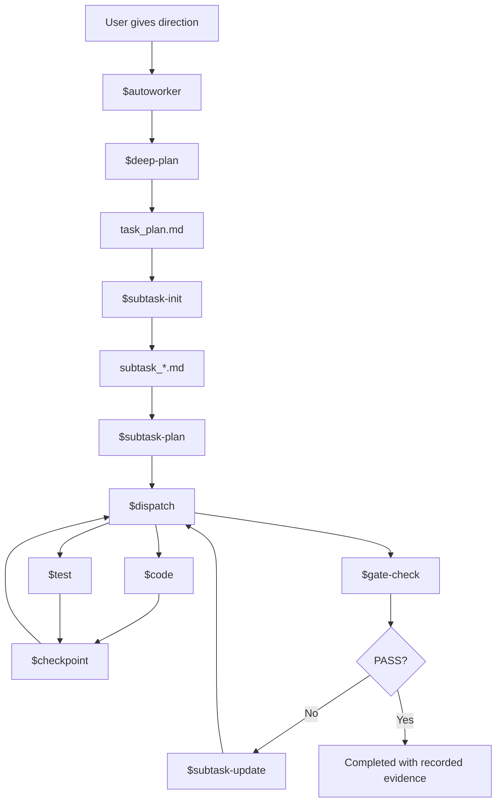

<p align="center">
  
  
  
  
</p>

<h1 align="center">Autoworker for Codex CLI</h1>

<p align="center">
  The open-source execution harness for people who want Codex to ship work, survive interruption, and earn the word "done."
</p>

<p align="center">
  Not another prompt pack. Not another fragile transcript. A real file-backed worker loop for Codex CLI.
</p>

<p align="center">
  <strong>Plan on disk.</strong> <strong>Progress on disk.</strong> <strong>Recovery on disk.</strong> <strong>Proof or it does not count.</strong>
</p>

<p align="center">
  <a href="#quick-start">Quick Start</a> •
  <a href="#killer-surface">Killer Surface</a> •
  <a href="#proof-not-vibes">Proof, Not Vibes</a> •
  <a href="#repo-map">Repo Map</a> •
  <a href="#中文说明">中文说明</a>
</p>

---

> Most agent setups act impressive right up until the session resets, the context drifts, or the agent declares victory with no evidence.  
> Autoworker is the answer to that class of failure.

## Why this repo exists

Most agent workflows break in painfully predictable ways:

- the real plan lives only in chat
- the agent says "done" before enough verification ran
- a fresh session forgets what happened and asks to be re-briefed
- recovery depends on human memory instead of repo state

Autoworker is built to shut those failure modes down.

It gives Codex a strict execution loop with durable files, explicit routing, verification gates, and restart-safe recovery.

> make Codex behave more like a long-running worker and less like a one-shot conversation

## Killer Surface

| What it does | Why it matters |
|---|---|
| **Codex-native workflow surface** via `AGENTS.md`, `.agents/skills/`, `.codex/hooks.json` | The repo itself becomes the runtime contract |
| **File-backed state** via `task_plan.md`, `subtask_*.md`, `.local/autoworker/state.json` | Resume stops depending on memory, luck, or manual re-briefing |
| **Strict execution loop** from planning to gate-check | Work advances in stages instead of improvising itself into ambiguity |
| **Evidence-first completion** with L1-L4 verification | "Looks right" is not accepted as a terminal state |
| **Recovery without guesswork** | The next move comes from disk state, not whatever the model happens to remember |
| **Parity proof with real Codex runs** | The workflow is exercised, not just described |

## The Pitch

Autoworker is for teams and solo builders who want an agent that can:

- keep going after interruption
- resume from the repo instead of the transcript
- separate planning, execution, testing, and gating
- produce receipts before claiming success

This is not the "ask nicely and hope" school of AI tooling.

It is a repo-native execution system for Codex CLI.

## The Loop



## Why It Hits Different

This repo is opinionated about three things:

1. **State must survive interruption**
   `task_plan.md`, active subtask files, and the machine-readable snapshot are first-class runtime assets.

2. **Completion must be observed, not narrated**
   The workflow treats verification evidence as the contract. "Looks done" is not a success state.

3. **Repo-native usage comes before packaging**
   The local repository is the primary product. Optional plugin packaging exists, but it stays secondary.

## Quick Start

### 1. Open this repo in Codex CLI

Primary runtime surfaces:

- `AGENTS.md`
- `.agents/skills/`
- `.codex/hooks.json`
- `scripts/`

### 2. Start the full autonomous path

```text
$autoworker
Build this feature autonomously, verify it with L1-L4 evidence, and do not stop until gate-check PASS.
```

### 3. If you want planning first

```text
$deep-plan
Add retry logic to the API client and prove it with build, unit, chain, and end-to-end verification.
```

Then start execution from the written plan:

```text
$subtask-init
Use the existing task_plan.md and begin execution.
```

### 4. Resume after interruption

```text
$dispatch
```

`$dispatch` is the safe resume entry point because it re-reads the active subtask from disk and routes to the next valid step instead of relying on prior chat state.

## Command Surface

- `$autoworker` — full autonomous loop for non-trivial work
- `$deep-plan` — explicit planning before execution
- `$subtask-init` — begin execution from an existing `task_plan.md`
- `$dispatch` — resume from the active `subtask_*.md`
- `python3 scripts/autoworker_state.py --json --write-state` — refresh or inspect the canonical workflow snapshot

## Durable State Snapshot

```bash
python3 scripts/autoworker_state.py --write-state
python3 scripts/autoworker_state.py --json --write-state
```

This produces `.local/autoworker/state.json`, which records:

- whether `task_plan.md` exists
- which subtasks are active, paused, or completed
- current checkbox progress
- latest workflow activity
- the recommended next command

When hooks are enabled, session start and stop refresh the same snapshot automatically.

## Proof, Not Vibes

If you claim a workflow is durable, resumable, and evidence-driven, you should be able to prove it.

This repo does.

- `verify-hooks.sh` checks repo-local hook wiring and nested-path safety
- `verify-codex-workspace.sh` performs a real `codex exec` visibility check
- `verify-autonomy-surface.sh` checks the state snapshot and resume guidance
- `verify-workflow-parity.sh` exercises planning, execution, recovery, and gate behavior with real Codex runs
- `verify-plugin-package.sh` ensures the optional packaged snapshot still matches the canonical runtime tree
- `tests/test_autoworker_state.py` validates snapshot logic

Run them from the repo root:

```bash
./scripts/verify-hooks.sh
./scripts/verify-codex-workspace.sh
./scripts/verify-autonomy-surface.sh
./scripts/verify-workflow-parity.sh
./scripts/verify-plugin-package.sh
python3 tests/test_autoworker_state.py
```

## Repo Map

If the directory layout looks busy, use this rule:

- **Canonical runtime**: edit and trust these first
- **Optional distribution**: only relevant if you want a packaged plugin
- **Legacy compatibility**: retained for migration history, not day-to-day authoring

| Layer | Paths | Role |
|---|---|---|
| Canonical runtime | `AGENTS.md`, `.agents/skills/`, `.codex/hooks.json`, `scripts/` | The real Codex workflow surface |
| Workflow state | `task_plan.md`, `subtask_*.md`, `.local/autoworker/state.json` | Durable execution and recovery |
| Optional distribution | `plugins/autoworker-codex/`, `.agents/plugins/marketplace.json` | Packaged snapshot after repo-native validation |
| Legacy / migration residue | `skills/`, `.claude-plugin/`, `CLAUDE.md` | Historical or compatibility material |

More detail: [docs/repo-layout.md](docs/repo-layout.md)

## Optional Plugin Package

Repo-native usage is the main story. If you want an installable snapshot anyway, the repo also ships:

- `plugins/autoworker-codex/.codex-plugin/plugin.json`
- `plugins/autoworker-codex/skills/`
- `.agents/plugins/marketplace.json`

Refresh that packaged snapshot when canonical skills change:

```bash
./scripts/sync-plugin-package.sh
```

## Built For

- long-running autonomous coding
- low-supervision execution
- evidence-backed completion
- fresh-session recovery
- repo-native Codex usage

## Not Built For

- chat-only memory workflows
- constant human routing between every step
- "looks done to me" completion
- packaging-first distribution stories
- single-transcript heroics with no durable state

## Read This Next

- [docs/codex-workspace.md](docs/codex-workspace.md) — repo-native usage in Codex
- [docs/repo-layout.md](docs/repo-layout.md) — canonical vs optional vs legacy paths
- [docs/migration/codex-migration-notes.md](docs/migration/codex-migration-notes.md) — what changed from the Claude-era workflow
- [plugins/autoworker-codex/README.md](plugins/autoworker-codex/README.md) — optional packaged snapshot

## English Summary

Autoworker is for people who want to say:

> "Don't just answer. Keep working, recover cleanly, and only stop when the proof is real."

That is the product.

---

# 中文说明

## 这不是“提示词包”，这是 Codex 的执行框架

Autoworker 不是为了让 Codex 看起来更聪明，而是为了让它在真实仓库里更像一个能持续干活、能断点恢复、能交付证据的执行系统：

- 先写计划，再执行
- 中断之后能从磁盘状态恢复
- 测试和验证结果要落盘
- 没有证据就不能算完成

一句话：

> 让 Codex 更像一个能长期跑任务的 worker，而不是一个上下文一断就失忆的聊天窗口。

## 它到底帅在哪

- **像产品，不像提示词集合**：入口、状态、恢复、验证都在 repo 里成体系
- **像执行系统，不像聊天记录**：关键状态写盘，不靠上下文运气
- **像工程流程，不像 vibe coding**：plan、dispatch、test、gate 一层一层推进
- **像交付，不像表演**：没有验证证据，就不能叫完成

## 你最需要知道的三件事

1. 入口用这些：`$autoworker`、`$deep-plan`、`$subtask-init`、`$dispatch`
2. 真正的运行面看这些：`AGENTS.md`、`.agents/skills/`、`.codex/hooks.json`
3. 真正的状态看这个：`.local/autoworker/state.json`

## 仓库怎么看才不乱

- `.agents/skills/` 是 **canonical runtime**
- `plugins/autoworker-codex/` 是 **可选分发快照**
- `skills/`、`.claude-plugin/`、`CLAUDE.md` 是 **迁移遗留/兼容材料**

如果你只想真的用它，不想研究迁移历史，那就盯住这几处：

```text
AGENTS.md
.agents/skills/
.codex/hooks.json
scripts/
docs/codex-workspace.md
```

## 适合谁

如果你想要的是下面这种能力，这个仓库就是对的：

- 让 Codex 长时间自己推进任务
- 让恢复依赖文件状态，而不是聊天记忆
- 让“完成”必须建立在真实验证上
- 让新会话接手时不用重新讲一遍上下文

## 一句话宣传版

> Autoworker = 把 Codex CLI 从“会回答”升级成“会持续执行、会恢复、会自证完成”的 repo-native worker system。

## License

MIT
