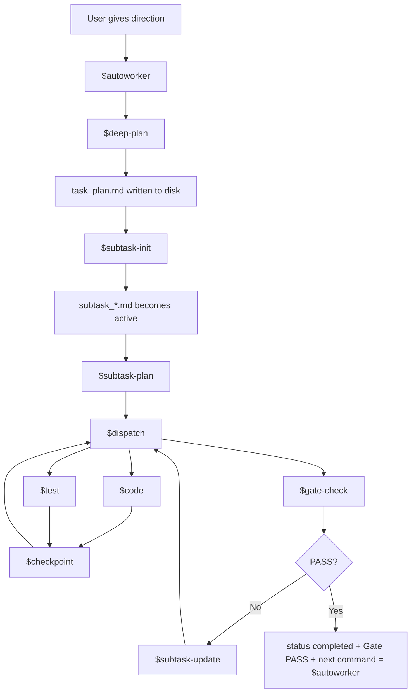
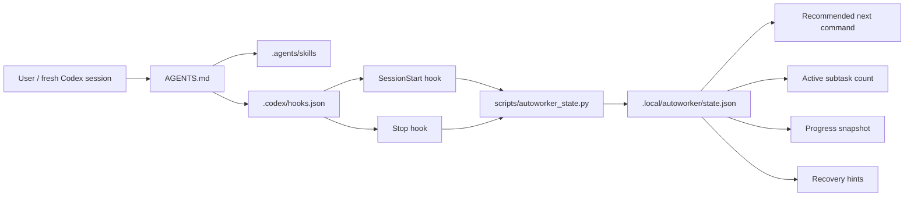
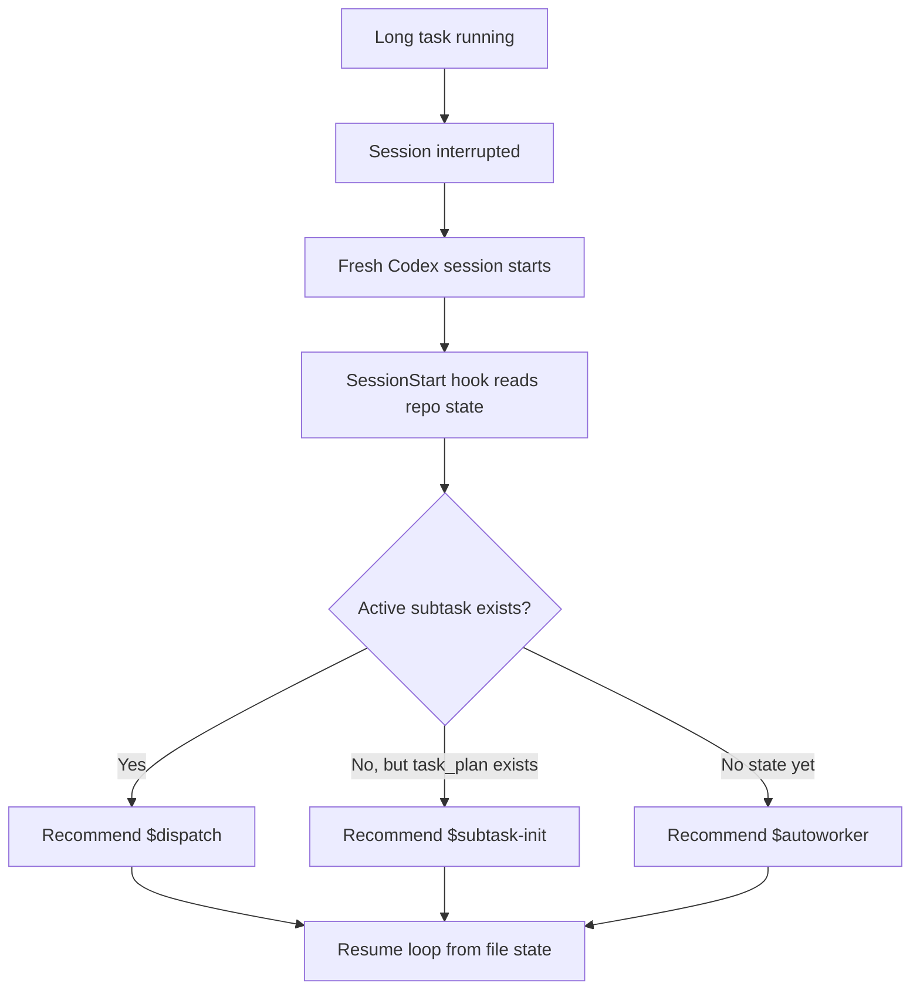
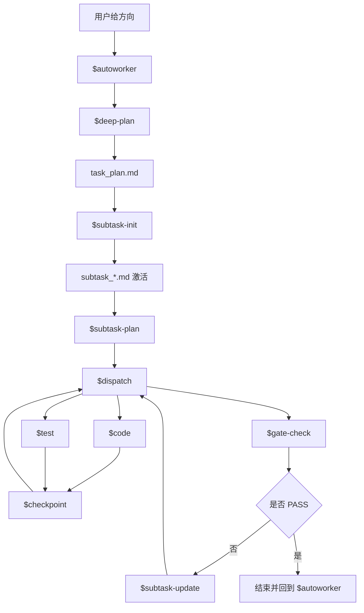
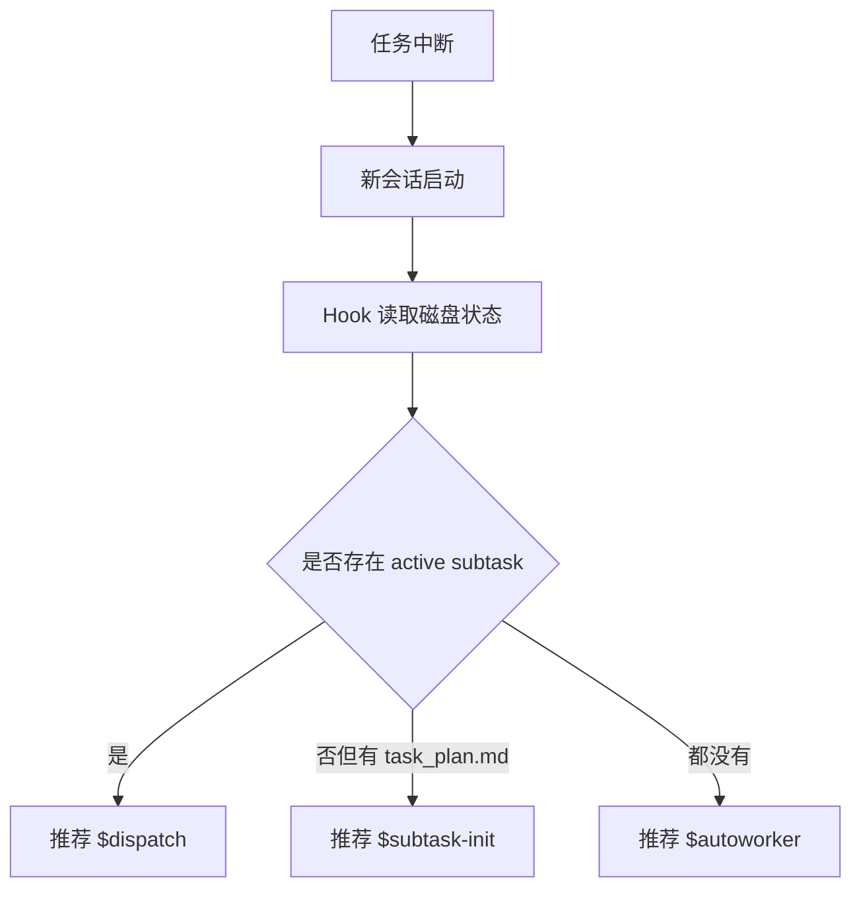

<p align="center">
  
  
  
  
</p>

<h1 align="center">Autoworker for Codex CLI</h1>

<p align="center">
  Make Codex run like a durable worker system, not a fragile chat session.
</p>

<p align="center">
  Plan on disk. State on disk. Verification on disk. Recovery on disk.
</p>

---

## What this is

Autoworker is a Codex-first autonomous execution workflow for people who want Codex to keep going for a long time without needing a human to repeatedly restate the plan, reconstruct the task, or manually decide what comes next.

It pushes Codex through a strict loop:

- plan deliberately
- execute in bounded phases
- test with recorded evidence
- pass a gate before claiming completion
- recover from disk instead of from chat memory

If you want **long-running, low-supervision, interruption-tolerant Codex work**, this repo is built for exactly that.

## Why it feels different

Most agent workflows break in predictable ways:

- the real plan only exists in chat
- the agent says "done" before running enough verification
- resume depends on human memory instead of repo state
- a fresh session loses momentum and asks the same questions again

Autoworker is designed to close those failure modes.

## The pitch in one screen

- **Codex-native first**: run it directly from a repo with `AGENTS.md`, `.agents/skills/`, and `.codex/hooks.json`
- **Durable workflow state**: `task_plan.md`, `subtask_*.md`, and `.local/autoworker/state.json` keep the execution surface alive
- **Strict execution loop**: `$autoworker -> $deep-plan -> $subtask-init -> $dispatch`
- **Evidence-first completion**: L1-L4 verification plus `gate-check` decide when work is actually done
- **Hook-assisted recovery**: Session start/stop refresh the on-disk snapshot and provide the next-step hint
- **Real parity validation**: the repo includes scripts that exercise actual Codex runs, not just static checks

## Visual Overview

### 1. The autonomous loop



### 2. The durable state surface



### 3. Failure and recovery path



## Built for / Not built for

| Built for | Not built for |
|---|---|
| Long-running autonomous coding | Highly chatty pair-programming sessions |
| File-backed recovery | Memory-only workflows |
| Evidence-based completion | "Looks done to me" completion |
| Low-supervision execution | Constant human routing between every step |
| Repo-native Codex workflows | Tooling that only works inside one chat transcript |

## Quick Start

### 1. Open the repository in Codex CLI

The canonical runtime surfaces are:

- `AGENTS.md`
- `.agents/skills/`
- `.codex/hooks.json`
- `.codex/hooks/`
- `scripts/`

### 2. Start a non-trivial task

```text
$autoworker
Build this feature autonomously, verify it with L1-L4 evidence, and only stop on gate-check PASS.
```

### 3. If you want explicit planning first

```text
$deep-plan
Add retry logic to the API client and prove it with build, unit, chain, and end-to-end verification.
```

Then begin execution from the written plan:

```text
$subtask-init
Use the existing task_plan.md and begin execution.
```

### 4. Resume after interruption

```text
$dispatch
```

`$dispatch` is the safe resume entry point because it re-reads the active subtask from disk and routes to the next valid step automatically.

## Command Surface

Recommended entry points:

- `$autoworker` — full autonomous loop for non-trivial work
- `$deep-plan` — deliberate planning before execution
- `$subtask-init` — start execution from an existing `task_plan.md`
- `$dispatch` — resume from the active `subtask_*.md`
- `python3 scripts/autoworker_state.py --json --write-state` — inspect or refresh the canonical workflow snapshot
- `commands/autoworker-status.md` — human-readable command surface for checking status inside the repo workflow

## Durable Workflow Snapshot

Autoworker ships with a dedicated state surface for long-running automation:

```bash
python3 scripts/autoworker_state.py --write-state
python3 scripts/autoworker_state.py --json --write-state
```

This produces `.local/autoworker/state.json`, a canonical snapshot of:

- whether `task_plan.md` exists
- which subtasks are active, paused, or completed
- current checkbox progress
- latest workflow activity timestamp
- the recommended next command (`$dispatch`, `$subtask-init`, or `$autoworker`)

The hooks refresh the same snapshot automatically at session start and stop, so the repo behaves more like a **durable worker harness** and less like a **fragile chat log**.

## Validation Suite

Run these from repo root:

```bash
./scripts/verify-hooks.sh
./scripts/verify-codex-workspace.sh
./scripts/verify-autonomy-surface.sh
./scripts/verify-workflow-parity.sh
./scripts/verify-plugin-package.sh
python3 tests/test_autoworker_state.py
```

What they cover:

- `verify-hooks.sh` checks repo-local hook wiring
- `verify-codex-workspace.sh` does a real `codex exec` visibility check
- `verify-autonomy-surface.sh` checks the durable state snapshot plus hook-driven resume guidance
- `verify-workflow-parity.sh` runs the real Codex parity fixture and validates planning, execution, completion, and recovery
- `verify-plugin-package.sh` checks that the optional packaged plugin matches the canonical `.agents/skills/` tree
- `tests/test_autoworker_state.py` unit-tests the state snapshot logic

## Optional Plugin Package

If you want an installable Codex plugin snapshot instead of repo-native usage, this repo also includes:

- `plugins/autoworker-codex/.codex-plugin/plugin.json`
- `plugins/autoworker-codex/skills/`
- `.agents/plugins/marketplace.json`

Refresh the packaged snapshot when canonical skills change:

```bash
./scripts/sync-plugin-package.sh
```

## Repository Layout

```text
.
├── AGENTS.md
├── .agents/skills/
├── .codex/hooks.json
├── .codex/hooks/
├── commands/
├── docs/
├── plugins/autoworker-codex/
├── scripts/
└── tests/
```

## English Summary

Autoworker is for one specific kind of user:

> "I don't want Codex to just answer. I want it to keep working, recover cleanly, and only stop when the proof is real."

If that's your goal, this repo gives you a strong starting point.

---

# 中文说明

## 这是什么

Autoworker 是一个面向 Codex CLI 的自动执行工作流。它不是为了“陪聊式写代码”，而是为了让 Codex：

- 长时间持续推进任务
- 中断后从磁盘状态恢复
- 把计划、执行状态、验证证据都写进仓库
- 只有在真实验证通过后才允许完成

一句话：

> 让 Codex 更像一个可恢复、可验证、可长期运行的 worker system，而不是一次性聊天助手。

## 它为什么更适合长时间自动跑

普通 agent 工作流常见的问题：

- 计划只在聊天里，刷新会话后就丢
- 还没真的验证，就先宣布 done
- 恢复靠人脑回忆，而不是靠文件状态
- 每次中断都要重新解释一遍上下文

Autoworker 的目标，就是把这些坑尽量堵住。

## 核心能力

- **严格自动循环**：`$autoworker -> $deep-plan -> $subtask-init -> $dispatch`
- **文件化恢复**：`task_plan.md`、`subtask_*.md`、`.local/autoworker/state.json`
- **状态快照**：`python3 scripts/autoworker_state.py --json --write-state`
- **证据优先**：必须完成 L1-L4 验证与 `gate-check`
- **Hook 辅助恢复**：session start / stop 自动刷新状态与下一步提示
- **真实链路验证**：不是只做静态检查，而是真的跑 Codex parity 流程

## 最常用命令

```text
$autoworker
$deep-plan
$subtask-init
$dispatch
```

查看当前状态：

```bash
python3 scripts/autoworker_state.py --write-state
```

输出机器可读 JSON：

```bash
python3 scripts/autoworker_state.py --json --write-state
```

## 流程图示意

### 自动执行主循环



### 恢复路径



## 验证命令

```bash
./scripts/verify-hooks.sh
./scripts/verify-codex-workspace.sh
./scripts/verify-autonomy-surface.sh
./scripts/verify-workflow-parity.sh
./scripts/verify-plugin-package.sh
python3 tests/test_autoworker_state.py
```

## 适合谁

如果你的目标是：

- 想让 Codex 长时间自己跑
- 不想每隔几轮就人工重新解释上下文
- 希望恢复依赖文件状态，而不是聊天记忆
- 希望“完成”必须建立在真实验证上

那这个仓库就是为这种场景准备的。

## License

MIT
